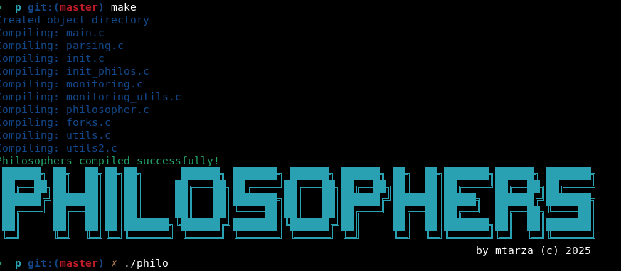

<a name="readme-top"></a>
<div align="center">
  <!-- Logo -->
  <a href="https://github.com/mtarza13/42-Philosophers">
    
  </a>

  <!-- Project Name -->
  <h1>🍝 Philosophers Project</h1>

  <!-- Short Description -->
  <p align="center">
    <b>42 School - Dining Philosophers Problem</b><br>
    A multithreading project exploring concurrent programming and synchronization
  </p>

  <!-- Badges -->
  <p>
    
    
    
    
  </p>

  <h3>
    <a href="#-about-project">📜 About</a>
    <span> · </span>
    <a href="#-the-problem">🧠 Problem</a>
    <span> · </span>
    <a href="#-implementation">⚙️ Implementation</a>
    <span> · </span>
    <a href="#-usage">🚀 Usage</a>
    <span> · </span>
    <a href="#-testing">🧪 Testing</a>
  </h3>
</div>

---

## 📜 About Project

The **Philosophers** project is a classic computer science problem that explores the challenges of **concurrent programming** and **resource sharing**. This implementation uses **POSIX threads** (pthreads) and **mutexes** to solve the dining philosophers problem while avoiding **deadlocks** and **race conditions**.

### 🎯 Learning Objectives
- Master **multithreading** concepts
- Understand **mutex** synchronization
- Handle **shared memory** safely
- Prevent **deadlocks** and **race conditions**
- Work with **POSIX threads** (pthreads)

> [!NOTE]
> This project follows **42 School coding standards**:
> - Maximum 25 lines per function
> - Variables declared at function top
> - Only allowed functions may be used
> - No memory leaks or undefined behavior

---

## 🧠 The Problem

### 📖 Dining Philosophers Problem

The classic synchronization problem introduced by **Edsger Dijkstra**:

```
    🍝
   /   \
  🥄     🥄
 👨      👨
🥄        🥄
 👨  🥄  👨
   \   /
    👨
```

#### Rules:
- **N philosophers** sit around a circular table
- **N forks** placed between each philosopher  
- Each philosopher needs **2 forks** to eat
- Philosophers alternate between: **thinking** → **eating** → **sleeping**
- If a philosopher doesn't eat within `time_to_die`, they **die**
- Philosophers **cannot communicate** with each other

#### Challenge:
Coordinate access to shared resources (forks) without causing:
- **Deadlocks** (all philosophers stuck waiting)
- **Starvation** (a philosopher never gets to eat)
- **Race conditions** (data corruption)

---

## ⚙️ Implementation

### 🏗️ Architecture

```
📁 Project Structure
├── 📄 main.c              # Program entry point
├── 📄 parsing.c           # Argument validation
├── 📄 init.c              # Initialize simulation
├── 📄 init_philos.c       # Initialize philosophers
├── 📄 philosopher.c       # Philosopher behavior
├── 📄 forks.c             # Fork management
├── 📄 monitoring.c        # Death/completion monitoring
├── 📄 monitoring_utils.c  # Monitoring utilities
├── 📄 utils.c             # General utilities
├── 📄 utils2.c            # Additional utilities
├── 📄 philo.h             # Header file
└── 📄 Makefile            # Build configuration
```

### 🔧 Key Components

#### Data Structures
```c
typedef struct s_philo {
    int             id;                 // Philosopher ID (1-N)
    int             meals_eaten;        // Meals consumed
    long long       last_meal_time;     // Timestamp of last meal
    pthread_t       thread;             // Philosopher thread
    pthread_mutex_t *left_fork;         // Left fork mutex
    pthread_mutex_t *right_fork;        // Right fork mutex
    struct s_data   *data;              // Shared data reference
} t_philo;

typedef struct s_data {
    int             philo_count;        // Number of philosophers
    long long       time_to_die;       // Death timer (ms)
    long long       time_to_eat;       // Eating duration (ms)
    long long       time_to_sleep;     // Sleeping duration (ms)
    int             must_eat_count;     // Required meals (-1 if not specified)
    long long       start_time;        // Simulation start time
    int             simulation_end;     // End flag
    pthread_mutex_t *forks;             // Fork mutexes array
    pthread_mutex_t print_mutex;       // Print synchronization
    pthread_mutex_t data_mutex;        // Data access synchronization
    t_philo         *philos;            // Philosophers array
} t_data;
```

#### Synchronization Strategy
1. **Fork Ordering**: Prevent deadlocks by ordering fork acquisition
2. **Mutex Protection**: Guard shared data access
3. **Atomic Operations**: Ensure thread-safe state changes
4. **Death Monitoring**: Separate monitoring thread checks for deaths

---

## 🚀 Usage

### Prerequisites
- **GCC compiler**
- **POSIX-compliant system** (Linux, macOS)
- **pthread library**

### Compilation
```bash
# Clone the repository
git clone https://github.com/mtarza13/42-Philosophers.git
cd 42-Philosophers

# Compile the project
make

# Clean object files
make clean

# Remove all generated files
make fclean

# Recompile everything
make re
```

### Execution
```bash
./philo <number_of_philosophers> <time_to_die> <time_to_eat> <time_to_sleep> [number_of_times_each_philosopher_must_eat]
```

#### Parameters:
- **`number_of_philosophers`**: Number of philosophers (and forks) [1-200]
- **`time_to_die`**: Time in ms before a philosopher dies without eating
- **`time_to_eat`**: Time in ms a philosopher spends eating
- **`time_to_sleep`**: Time in ms a philosopher spends sleeping
- **`number_of_times_each_philosopher_must_eat`**: *(Optional)* Simulation stops when all philosophers have eaten this many times

#### Example Usage:
```bash
# 5 philosophers, 800ms to die, 200ms eating, 200ms sleeping
./philo 5 800 200 200

# With meal limit: stop after each philosopher eats 7 times
./philo 5 800 200 200 7

# Edge case: 1 philosopher (should die)
./philo 1 800 200 200

# Stress test: Many philosophers
./philo 100 410 200 200
```

---

## 🧪 Testing

### 📊 Test Scenarios

#### Basic Functionality
```bash
# Normal case - should run indefinitely without deaths
./philo 5 800 200 200

# With meal limit - should stop when all eat 7 times
./philo 4 410 200 200 7
```

#### Edge Cases
```bash
# Single philosopher - should die (can't eat with 1 fork)
./philo 1 800 200 200

# Tight timing - challenging synchronization
./philo 4 310 200 100

# Many philosophers - stress test
./philo 200 410 200 200
```

#### Expected Output Format
```
0 1 has taken a fork
0 1 is eating
0 3 has taken a fork
0 3 is eating
200 1 is sleeping
200 3 is sleeping
200 2 has taken a fork
200 4 has taken a fork
200 2 is eating
200 4 is eating
400 1 is thinking
400 3 is thinking
400 2 is sleeping
400 4 is sleeping
```

### ✅ Validation Checklist

- [ ] **No data races**: Use tools like `valgrind --tool=helgrind`
- [ ] **No memory leaks**: Check with `valgrind --leak-check=full`
- [ ] **No deadlocks**: Philosophers don't get stuck
- [ ] **Accurate timing**: Death detection within 10ms
- [ ] **Proper cleanup**: All threads and mutexes properly destroyed
- [ ] **Edge cases**: Handle 1 philosopher, invalid inputs
- [ ] **Performance**: Handles 200+ philosophers efficiently

### 🔍 Debugging Tools
```bash
# Check for data races
valgrind --tool=helgrind ./philo 5 800 200 200

# Check for memory leaks
valgrind --leak-check=full ./philo 5 800 200 200

# Monitor resource usage
top -p $(pgrep philo)
```

---

## 📸 Demo



---

## 🎓 Key Learnings

### Multithreading Concepts
- **Thread creation** and **synchronization**
- **Mutex** usage and **deadlock prevention**
- **Race condition** mitigation
- **Shared memory** management

### Problem-Solving Techniques
- **Resource ordering** to prevent circular wait
- **Time-based monitoring** for death detection
- **Atomic operations** for thread safety
- **Graceful shutdown** handling

### System Programming
- **POSIX threads** (pthreads) API
- **Precise timing** with `gettimeofday()`
- **Signal handling** and **process control**
- **Memory management** in multithreaded environment

---

## 🔧 Technical Details

### Deadlock Prevention Strategy
The implementation uses **resource ordering** to prevent deadlocks:
```c
// Always acquire lower-numbered fork first
if (philo->id % 2 == 0) {
    pthread_mutex_lock(philo->right_fork);
    pthread_mutex_lock(philo->left_fork);
} else {
    pthread_mutex_lock(philo->left_fork);
    pthread_mutex_lock(philo->right_fork);
}
```

### Timing Precision
- Uses `gettimeofday()` for **microsecond precision**
- Custom **`usleep()` replacement** for accurate delays
- **Death monitoring** runs every 1ms for quick detection

### Thread Safety
- All **shared data** protected by mutexes
- **Print operations** synchronized to prevent output corruption
- **Atomic state changes** ensure consistency

---

## 📚 Resources

- [Dining Philosophers Problem - Wikipedia](https://en.wikipedia.org/wiki/Dining_philosophers_problem)
- [POSIX Threads Programming](https://computing.llnl.gov/tutorials/pthreads/)
- [Deadlock Prevention Strategies](https://www.geeksforgeeks.org/deadlock-prevention/)
- [42 School Projects](https://github.com/42School)

---

## 👨‍💻 Author

**mtarza** - [GitHub Profile](https://github.com/mtarza13)

*42 School Student | System Programming Enthusiast*

---

## 📄 License

This project is part of the 42 School curriculum. Please respect the academic integrity policies of your institution.

---

<div align="center">
  <p>
    <b>⭐ If this project helped you, please give it a star! ⭐</b>
  </p>
  
  <p>
    <a href="#readme-top">🔝 Back to top</a>
  </p>
</div>